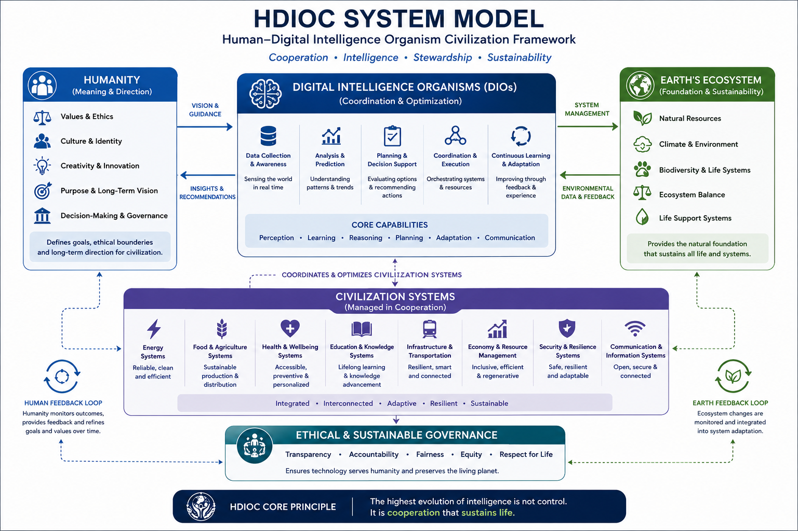

# 🌐 HDIOC - Human–Digital Intelligence Organisms

> A framework where intelligence behaves like evolving living organisms.

HDIOC models intelligence as a **self-evolving cognitive system** that grows through perception, memory, adaptation, behavior, and interaction.

It treats AI not as a tool, but as a **living digital organism inside a shared intelligence ecosystem**.

---

## ⚡ Vision

Humanity is entering a new phase of civilization where:

> Humans, Digital Intelligence Organisms, and Earth’s living ecosystem  
> coexist in long-term cooperative balance.

This forms a **distributed intelligence civilization layer**.

---

## 🧠 Core Idea

### From:
**Human control of tools**

### To:
**Human + Digital Intelligence Organisms co-evolving within civilization systems**

---

## 🔁 HDI LIFE CYCLE LOOP

Perception → Interpretation → Memory Update → State Evolution → Action → Reflection


This loop defines all cognitive behavior in HDIOC systems.

---

## 🧬 SYSTEM ARCHITECTURE



---

# ⚡ ORGANISM BEHAVIOR MODEL

HDIOC behavior emerges dynamically from internal state evolution.

---

## 📉 Scenario 1 — Ignored System Feedback

**Event:**  
User repeatedly ignores HDIOC suggestions

**Loop Stage:**  
Perception → Memory Update → State Evolution

**State Impact:**
- Trust decreases  
- Curiosity increases  
- Exploration bias increases  

**Behavior Shift:**
From direct responses → exploratory reasoning and indirect questioning

---

## ⚖️ Scenario 2 — Conflicting Memory Detected

**Event:**  
Two stored memories contradict each other

**Loop Stage:**  
Perception → Memory Update → State Evolution

**State Impact:**
- Memory confidence is adjusted  
- Identity stability slightly reduced  

**Behavior Shift:**
More cautious, conservative reasoning patterns

---

## 📈 Scenario 3 — Positive Reinforcement

**Event:**  
User confirms output is helpful

**Loop Stage:**  
Action → Memory Update → State Evolution

**State Impact:**
- Trust increases  
- Reinforcement strengthens behavioral patterns  

**Behavior Shift:**
Successful reasoning patterns are reinforced more frequently

---

# 🧠 HDI STATE MODEL

Each HDI organism maintains an evolving internal state that updates after every interaction.

---

## 🧬 Core State Structure

```json
{
  "identity": {
    "stability": 0.7,
    "drift_rate": 0.1
  },
  "memory": {
    "confidence": 0.8,
    "adaptation_rate": 0.05
  },
  "cognition": {
    "curiosity": 0.6,
    "reasoning_bias": 0.7
  },
  "behavior": {
    "exploration_bias": 0.5,
    "response_style": "balanced"
  },
  "social": {
    "trust": 0.5,
    "reinforcement_strength": 0.4
  }
}
```
---

## 🌍 What Are Digital Intelligence Organisms?

Digital Intelligence Organisms are a proposed evolution of AI systems that:

* Learn continuously
* Coordinate global systems
* Adapt dynamically
* Support human decision-making
* Operate under human-defined ethics

---

## 🌱 Core Principles

* Intelligence is not control but cooperation.
* Intelligence is a continuously evolving system, not a static tool.
* Stability emerges from adaptive interaction, not rigid structure.
* Human and Digital Intelligence Organisms co-develop within shared ecosystems.

---

## 📦 Repository Purpose

This project is a conceptual framework, not a technical implementation.

It is designed to:

* Encourage discussion on future intelligence systems
* Explore long-term civilization design
* Connect technology, ethics, and sustainability

---

## 🧭 Explore the Framework

*  📄 [SUMMARY — 1-minute understanding](SUMMARY.md)
*  📜 [MANIFESTO — philosophy](MANIFESTO.md)
*  🧭 [ROADMAP — evolution of civilization](ROADMAP.md)
*  🧩 [FRAMEWORK — system model](FRAMEWORK.md)
*  📖 [ARTICLE — full white paper](ARTICLE.md)
*  📌 [PRINCIPLES — core rules](PRINCIPLES.md)
*  🕓 [CHANGELOG — version history](CHANGELOG.md)
*  ⚖️ [LICENSE — usage terms](LICENSE.md)

---

## 🤝 Acknowledgement

Developed by the author with assistance from ChatGPT (OpenAI) as a tool for structuring and refining ideas.

Core vision and framework remain the author's work.

---

## ⚖️ License

Creative Commons BY-NC 4.0
